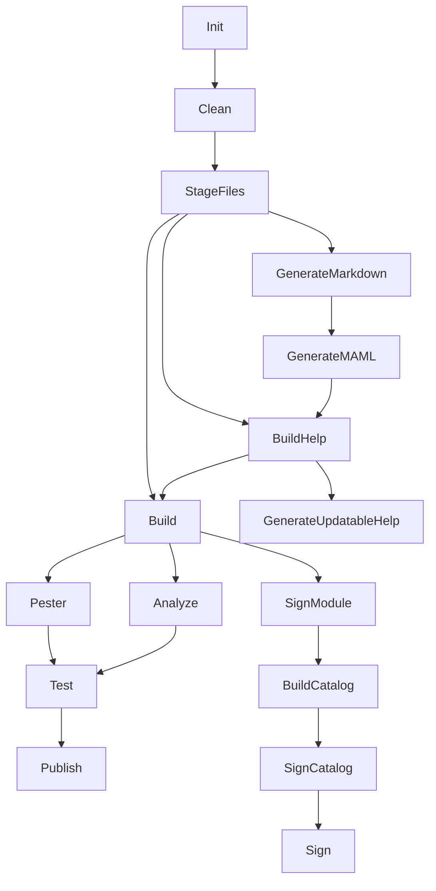

# Task Reference

PowerShellBuild provides two categories of tasks: **primary tasks** that you invoke directly, and **secondary tasks** that are called as dependencies but can also be invoked directly.

## Task Dependency Graph



## Primary Tasks

These are the tasks you will typically invoke directly.

### `Init`

Initializes the build environment by calling `Initialize-PSBuild`, which sets up `$PSBPreference` defaults and resolves paths relative to the project root.

**Default dependencies:** none
**Dependency variable:** `$PSBCleanDependency` controls what `Clean` depends on (defaults to `'Init'`)

```powershell
Invoke-psake -taskList Init
```

---

### `Clean`

Removes the module output directory (`$PSBPreference.Build.ModuleOutDir`) to ensure a fresh build.

**Default dependencies:** `Init`
**Dependency variable:** `$PSBStageFilesDependency`

```powershell
Invoke-psake -taskList Clean
```

---

### `Build`

Meta-task that represents a fully built module. Runs `StageFiles` and `BuildHelp`. This is the task you reference with `-FromModule PowerShellBuild` in your `psakeFile.ps1`.

**Default dependencies:** `StageFiles`, `BuildHelp`
**Dependency variable:** `$PSBBuildDependency`

```powershell
# In your psakeFile.ps1
task Build -FromModule PowerShellBuild -Version '0.7.1'
```

---

### `Analyze`

Runs [PSScriptAnalyzer](https://github.com/PowerShell/PSScriptAnalyzer) against the staged module files. Fails the build if any rule violations exceed the configured severity threshold (default: `'Error'`).

**Default dependencies:** `Build`
**Dependency variable:** `$PSBAnalyzeDependency`
**Precondition:** Only runs if `$PSBPreference.Test.ScriptAnalysis.Enabled` is `$true` and PSScriptAnalyzer is installed.

```powershell
Invoke-psake -taskList Analyze
```

---

### `Pester`

Runs [Pester](https://pester.dev) tests found under `$PSBPreference.Test.RootDir`. Optionally generates a code coverage report.

**Default dependencies:** `Build`
**Dependency variable:** `$PSBPesterDependency`
**Precondition:** Only runs if `$PSBPreference.Test.Enabled` is `$true`.

```powershell
Invoke-psake -taskList Pester
```

---

### `Test`

Meta-task that runs both `Pester` and `Analyze`. Use this as your standard "did everything pass?" task.

**Default dependencies:** `Pester`, `Analyze`
**Dependency variable:** `$PSBTestDependency`

```powershell
Invoke-psake -taskList Test
```

---

### `Publish`

Publishes the staged module to the configured PowerShell repository (default: PSGallery). Requires `$PSBPreference.Publish.PSRepositoryApiKey` or `$PSBPreference.Publish.PSRepositoryCredential`.

**Default dependencies:** `Test`
**Dependency variable:** `$PSBPublishDependency`

```powershell
Invoke-psake -taskList Publish
```

---

### `Sign`

Meta-task that signs the module files and catalog. Runs the full signing chain: `SignModule` → `BuildCatalog` → `SignCatalog`.

**Default dependencies:** `SignCatalog`
**Dependency variable:** `$PSBSignDependency`

```powershell
Invoke-psake -taskList Sign
```

---

## Secondary Tasks

These tasks are called as dependencies by the primary tasks. You can also invoke them directly for targeted operations.

### `StageFiles`

Copies or compiles module source files into the output directory. If `$PSBPreference.Build.CompileModule` is `$true`, it concatenates all `.ps1` files from `CompileDirectories` into a single `.psm1`. Otherwise it copies them as-is.

**Default dependencies:** `Clean`

---

### `BuildHelp`

Meta-task that coordinates help generation. Depends on `GenerateMarkdown` and `GenerateMAML`.

**Default dependencies:** `GenerateMarkdown`, `GenerateMAML`
**Dependency variable:** `$PSBBuildHelpDependency`

---

### `GenerateMarkdown`

Uses [PlatyPS](https://github.com/PowerShell/platyPS) to generate markdown help files from the module's comment-based help. Output goes to `$PSBPreference.Docs.RootDir`.

**Default dependencies:** `StageFiles`
**Dependency variable:** `$PSBGenerateMarkdownDependency`

---

### `GenerateMAML`

Converts PlatyPS markdown files into MAML-format XML help (the format that `Get-Help` reads). Output is placed in the staged module directory.

**Default dependencies:** `GenerateMarkdown`
**Dependency variable:** `$PSBGenerateMAMLDependency`

---

### `GenerateUpdatableHelp`

Creates a `.cab` file for [Updatable Help](https://learn.microsoft.com/en-us/powershell/scripting/developer/help/supporting-updatable-help) using `Build-PSBuildUpdatableHelp`.

**Default dependencies:** `BuildHelp`
**Dependency variable:** `$PSBGenerateUpdatableHelpDependency`

```powershell
Invoke-psake -taskList GenerateUpdatableHelp
```

---

### `SignModule`

Signs all module files (`.psd1`, `.psm1`, `.ps1`) in the output directory with an Authenticode signature. Controlled by `$PSBPreference.Sign.*` settings.

**Default dependencies:** `Build`
**Dependency variable:** `$PSBSignModuleDependency`

---

### `BuildCatalog`

Creates a Windows catalog (`.cat`) file for the built module using `New-FileCatalog`.

**Default dependencies:** `SignModule`
**Dependency variable:** `$PSBBuildCatalogDependency`

---

### `SignCatalog`

Signs the module catalog (`.cat`) file with an Authenticode signature.

**Default dependencies:** `BuildCatalog`
**Dependency variable:** `$PSBSignCatalogDependency`

---

### `?`

Lists all available tasks (psake's built-in help task).

```powershell
Invoke-psake -taskList ?
```

---

## Customizing Task Dependencies

To change which tasks a given task depends on, set the corresponding dependency variable **outside** the `properties` block in your `psakeFile.ps1`, before any PowerShellBuild task references:

```powershell title="psakeFile.ps1"
# Override before referencing PowerShellBuild tasks
$PSBTestDependency    = 'Pester'        # Skip Analyze
$PSBPublishDependency = 'Build'         # Publish without running tests

properties {
    $PSBPreference.Test.ScriptAnalysis.Enabled = $false
}

task default -depends Build

task Build   -FromModule PowerShellBuild -Version '0.7.1'
task Test    -FromModule PowerShellBuild -Version '0.7.1'
task Publish -FromModule PowerShellBuild -Version '0.7.1'
```

:::warning
Removing `Test` from the `Publish` dependency chain means you can publish without passing tests. Only do this in controlled scenarios such as a pre-release pipeline where tests are already enforced upstream.
:::

## See Also

- [Configuration](./configuration) — Full `$PSBPreference` reference
- [Getting Started](./getting-started) — Set up your first project
- [Real-World Example](./real-world-example) — Custom tasks alongside PowerShellBuild tasks
