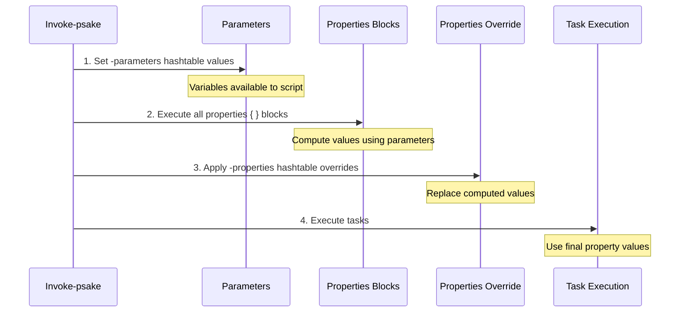

Parameters and properties are two different ways to pass values into your psake build scripts. Understanding when to use each one is crucial for creating flexible, maintainable build automation.

## Quick Decision Guide

**Use Parameters when:**
- You need to pass external values that your properties blocks will use to compute derived values
- You want to provide inputs that determine how properties are calculated
- You're passing configuration from CI/CD systems or command-line arguments

**Use Properties when:**
- You need to override final property values after all computations are complete
- You want to replace default values defined in your build script
- You're overriding environment-specific settings (like connection strings or paths)

## Execution Flow & Lifespan

Understanding the execution order is key to choosing between parameters and properties:



**Key Insight:** Parameters are set **before** properties blocks run, while property overrides are applied **after** all properties blocks have executed.

## When to Use Each

### Use Parameters For: Input Values

Parameters provide **input values** that your build script can use during the properties block execution phase. They're ideal for:

- Build configuration values (Debug/Release)
- Version numbers to be incorporated into file paths
- Feature flags that affect property calculations
- CI/CD system variables

**Example:** Using parameters to compute derived properties

```powershell title="parameters.ps1"
properties {
  $config = $configuration  # Use parameter value
  $outputPath = "bin\$config"  # Compute derived path
  $version = "$majorVersion.$minorVersion.0"  # Build version string
}

task default -depends Build

task Build {
  Write-Host "Building to: $outputPath"
  Write-Host "Version: $version"
}
```

```powershell title="Invocation"
# Pass input values that properties blocks will use
Invoke-psake .\parameters.ps1 -parameters @{
  "configuration" = "Release"
  "majorVersion" = "2"
  "minorVersion" = "1"
}

# Output:
# Building to: bin\Release
# Version: 2.1.0
```

### Use Properties For: Final Value Overrides

Properties provide **final value overrides** that replace values after all properties blocks have run. They're ideal for:

- Overriding default values for different environments
- Replacing computed values in specific scenarios
- Emergency hotfix values that bypass normal logic

**Example:** Overriding final property values

```powershell title="properties.ps1"
properties {
  $server = "localhost"  # Default value
  $database = "DevDB"    # Default value
  $connectionString = "Server=$server;Database=$database"
}

task default -depends Deploy

task Deploy {
  Write-Host "Deploying to: $connectionString"
}
```

```powershell title="Invocation"
# Override final values after properties blocks run
Invoke-psake .\properties.ps1 -properties @{
  "server" = "prod-sql-01"
  "database" = "ProductionDB"
}

# Output:
# Deploying to: Server=prod-sql-01;Database=ProductionDB
# Note: $connectionString still has the OLD computed value!
```

:::warning Properties Don't Recompute Derived Values

When you override a property, any derived values that were computed from it in the properties block are **NOT** automatically recalculated. In the example above, `$connectionString` would still contain the original computed value unless you override it directly as well.

:::

## Comparison: Side by Side

Let's see the difference with a concrete example:

```powershell title="build.ps1"
properties {
  $env = $environment  # Will be set if passed as parameter
  $deployPath = "C:\Deploy\$env"  # Computed from $env
}

task default -depends Info

task Info {
  Write-Host "Environment: $env"
  Write-Host "Deploy Path: $deployPath"
}
```

### Using Parameters (Input Values)

```powershell
Invoke-psake .\build.ps1 -parameters @{"environment"="Production"}

# Output:
# Environment: Production
# Deploy Path: C:\Deploy\Production
```

✅ The `$deployPath` property is correctly computed using the parameter value.

### Using Properties (Override After Computation)

```powershell
Invoke-psake .\build.ps1 -properties @{"environment"="Production"}

# Output:
# Environment: Production
# Deploy Path: C:\Deploy\
```

❌ The `$deployPath` is computed BEFORE the override, so it uses `$null` for `$env`.

### Using Both Together

```powershell
Invoke-psake .\build.ps1 `
  -parameters @{"environment"="Production"} `
  -properties @{"deployPath"="\\FileServer\Builds\Prod"}

# Output:
# Environment: Production
# Deploy Path: \\FileServer\Builds\Prod
```

✅ Parameter provides input for computation, property overrides the final value.

## Comparison Table

| Aspect | Parameters | Properties |
|--------|-----------|-----------|
| **Timing** | Set before properties blocks run | Applied after all properties blocks complete |
| **Purpose** | Provide inputs for computation | Override final computed values |
| **Derived Values** | Can be used to compute other properties | Do NOT trigger recomputation |
| **Best For** | Configuration inputs, build settings | Environment-specific overrides |
| **Use Case** | "I need this value to calculate others" | "I need to replace this final value" |

## Best Practices

### 1. Prefer Parameters for Inputs

When you need to pass values that affect multiple properties, use parameters:

```powershell
# ✅ Good: Use parameters for inputs
Invoke-psake .\build.ps1 -parameters @{
  "configuration" = "Release"
  "platform" = "x64"
}

# Properties block can use these to compute paths
properties {
  $config = $configuration
  $plat = $platform
  $outputPath = "bin\$plat\$config"
}
```

### 2. Use Properties for Environment-Specific Overrides

When deploying to different environments, use properties to override specific values:

```powershell
# ✅ Good: Override environment-specific values
Invoke-psake .\deploy.ps1 `
  -parameters @{"environment"="Production"} `
  -properties @{
    "serverName" = "prod-web-01"
    "connectionString" = "Server=prod-sql-01;..."
  }
```

### 3. Document Which Approach Your Script Expects

In your build script, document which values should be passed as parameters vs properties:

```powershell
<#
.SYNOPSIS
  Build automation script

.PARAMETER parameters
  Expected parameters:
  - configuration: Build configuration (Debug/Release)
  - version: Version number for the build

.PARAMETER properties
  Optional property overrides:
  - outputPath: Override computed output path
  - deployServer: Override target deployment server
#>

properties {
  $config = $configuration  # From -parameters
  $ver = $version          # From -parameters
  $outputPath = "bin\$config\$ver"  # Computed
  $deployServer = "localhost"       # Default (can override with -properties)
}
```

### 4. Avoid Overriding Properties That Other Properties Depend On

If you override a property that other properties are computed from, the dependent properties won't update:

```powershell
# ❌ Bad: Overriding $buildRoot won't affect $outputPath
properties {
  $buildRoot = "C:\Builds"
  $outputPath = "$buildRoot\Output"
}

Invoke-psake .\build.ps1 -properties @{"buildRoot"="D:\Builds"}
# Result: $buildRoot = "D:\Builds", but $outputPath = "C:\Builds\Output"

# ✅ Good: Pass as parameter so computation uses the right value
Invoke-psake .\build.ps1 -parameters @{"buildRoot"="D:\Builds"}
# Result: $buildRoot = "D:\Builds" AND $outputPath = "D:\Builds\Output"
```

## Summary

- **Parameters** = inputs set **before** properties blocks run → use for values that affect computations
- **Properties** = overrides applied **after** properties blocks run → use to replace final values
- Both can be used together for maximum flexibility
- When in doubt, prefer parameters for inputs and reserve properties for environment-specific overrides

:::tip Rule of Thumb

Ask yourself: "Does this value need to be used to calculate other properties?"
- **Yes** → Use `-parameters`
- **No** → Use `-properties`

:::
